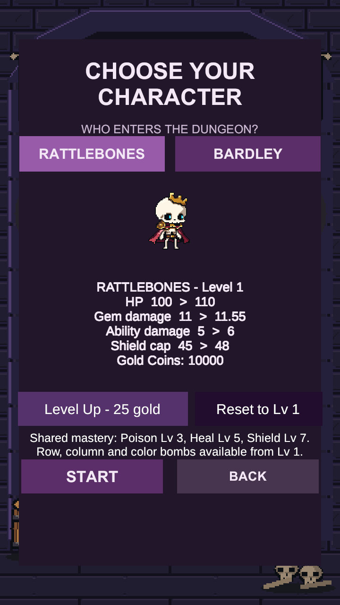
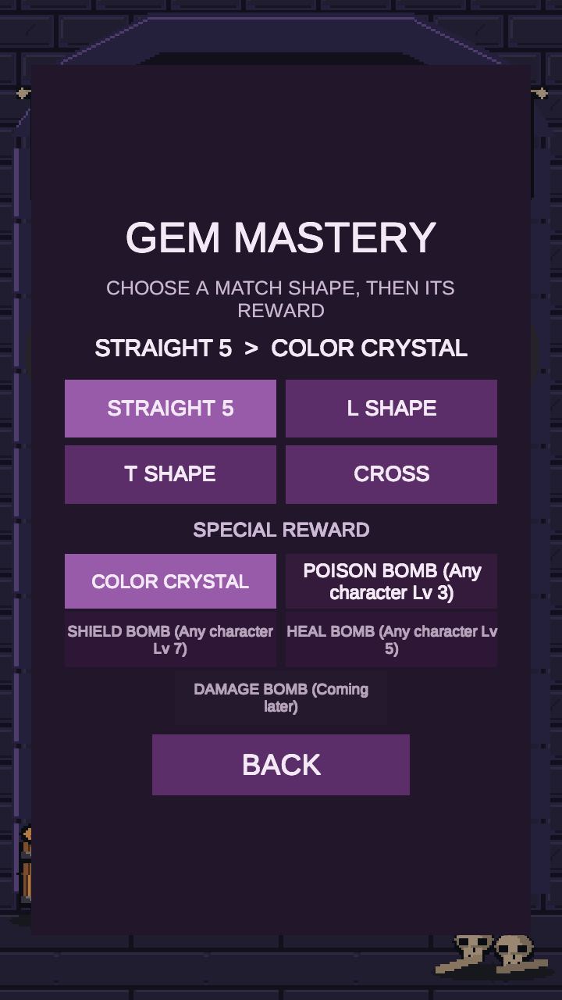
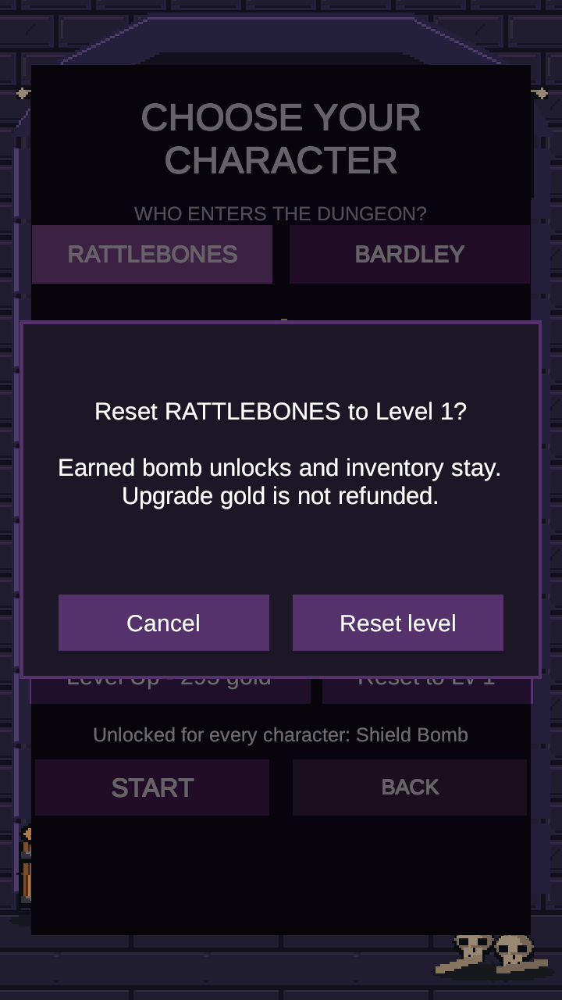

# Character reset and shared mastery unlocks

Validated 2026-09-22 with Unity 6000.3.19f1 on `codex/character-reset-mastery-unlocks`, based on background refinement PR #167.

## Behavior

- Characters provides **Reset to Lv 1** for the selected character, with a named confirmation and Cancel. It is disabled at level 1 or during a saved run.
- Reset changes only that character's level through the existing atomic account transaction. Other characters, gold, inventory, equipment, records, mastery selections and earned unlocks remain. Upgrade gold is not refunded.
- Row and Column bombs and Color Crystals are always available from level 1.
- Any one character reaching level 3 unlocks Poison, level 5 Healing, and level 7 Shield for the whole account. Levels do not sum. These rewards become selectable in Gem Mastery.
- Existing earned unlocks remain owned after resetting or changing thresholds. Releveling does not announce an already earned unlock again.

## Verification

- `Tools/Validate-Unity.ps1`: passed, Unity exit 0. Log: `%TEMP%/DungeonMatcher-UnityValidation-dd07c43e-0d91-4542-a49e-beccf27f3767.log`. An initial restricted-permission attempt could not connect to Unity licensing; the successful run used normal desktop permissions.
- `Tools/Test-Balance.ps1`: **251 passed, 0 failed, 0 skipped**. Results: `.utmp/balance-editmode.xml`; full log: `.utmp/balance-editmode.log`.
- `BalanceV1Tests` checks thresholds in both character directions, selectable rewards on the other level-1 character, independent reset/persistence, retained inventory/unlocks, level-1 stats, invalid/active-run rejection, disk-write failure atomicity and previous-threshold save compatibility.
- `BalanceFreshShapesPlayTests` exercises actual settled swaps producing Row Bomb, Column Bomb and Color Crystal on fresh level-1 profiles. The real-menu test exercises level upgrades, locked/unlocked reward buttons, Cancel/Confirm reset for both characters and relevel feedback.
- The menu test also passed separately with graphics enabled: **1 passed**, `.utmp/character-reset-menu.xml` and `.utmp/character-reset-menu.log`. Reviewed all five 720×1280 captures: labels fit, reset is visibly disabled at level 1, confirmation is readable, lock labels show 3/5/7 and Shield becomes selectable.
- Tests use disposable save files and temporary character/mastery scopes. No user account was reset. Game art, scenes, prefabs and combat-resolution ownership are unchanged. Unity's incidental TimeManager serialization migration was reverted.

These are Editor automated/runtime and visual checks, not an Android build or physical-device test. Historical Balance v1 records describe the old unlock schedule and are not rewritten as new evidence.

## Reviewed menu captures

