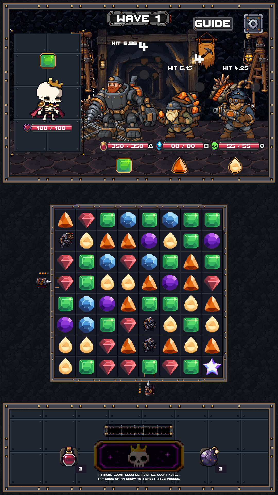
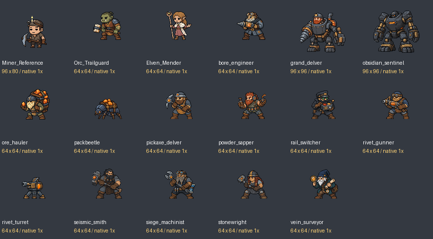

# Ironvein review evidence

This folder contains actual Unity screenshots, individual native-source checks,
three automated engine playthroughs and compact records extracted from executed
Unity XML results. Full logs remain at the paths in
[the validation record](../../IronveinExcavation/VALIDATION.md).

## Screen proof

| Shape | Actual capture |
| --- | --- |
| 720×1280 | [PNG](phase09-720x1280.png) |
| 1080×1920 | [PNG](phase09-1080x1920.png) |
| 1080×2400 | [PNG](phase09-1080x2400.png) |
| Safe-inset 1080×1920 | [PNG](phase09-1080x1920-safe.png) |

## Native comparison

Approved Miner, Orc Trailguard and Elven Mender source PNGs appear beside the
fourteen mine candidates at the same native pixel scale on neutral gray.
Individual source dimensions, alpha, palettes and hashes are recorded separately
in `ArtSource/Ironvein/Production/selected-technical.json`.

108 motion sheets and 14 stills pass the source-hash checks. All 2,404 tested
Unity GUID references resolve, including the installed UGUI Image script;
no duplicate Ironvein GUIDs were found. See [the static report](native-delivery-check.json).

## Pacing

The three `seed-*.txt` summaries and `seed-*-waves.csv` files record actual
production combat in disposable profiles, with synthetic input at 6× engine
speed. Stats and enemy attack cadence were not overridden. Game seconds are
reported, not wall-clock execution time. These are observations, not human
engagement evidence or a minimum visit duration.

## Review limits

- **PASS**: 56 current mine/affected cases on their latest executions, 157 final
  existing-zone compatibility cases and the mandatory Unity 6000.3.19f1 validator.
  Counts across runs can overlap. Source hash/GUID checks, actual portrait layout,
  weighted teaching and saved four-zone travel have separate evidence.
- **VISUAL REVIEW PENDING**: new characters, animations, cave composition and UI.
- **LISTENING REVIEW PENDING**: original temporary music and sound mix. Tests muted audio.
- **NOT EXECUTED**: manual human play sessions, physical touch and acoustic review.
- **DEVICE TEST PENDING**: Android hardware performance, cutouts, touch and sound.

Historical failures and corrected reruns remain in the owning validation record.
Passing affected checks is not a claim that every historical repository test is
green. The user explicitly approved merging PR #183 on 2026-10-08; this does not
replace the remaining human review and device checks.

## Playtest entry and remaining review

Start a new run and choose **Ironvein Excavation** in the existing temporary
zone picker. The in-game Guide explains the stone and machine rules. Existing
saves continue in their recorded zone; selecting a new start does not change a
suspended run's destination.

For the first human session, assess whether the two intake cells and charge
pips explain how to use the fixed drills, whether stones leave useful moves,
and whether the Bore warning clearly shows where its small bit will stop.
Compare ordinary and ore-powered contacts, then suspend and Continue while a
warning is active. Review the full Grand Delver formation and onward travel.
The optional pilot/remount experiment is disabled in production data.

The local gallery is `http://127.0.0.1:8891/Review.html`; it includes actual-speed
and slowed native motion, source comparisons, all four screen shapes and a
temporary music player with no autoplay. `Tools/Serve-IronveinReview.ps1` restarts
the local server after `Tools/Review-IronveinDelivery.py` assembles the existing
art/motion/screen galleries. These instructions are review steps, not evidence
that human playtesting or listening has occurred.
